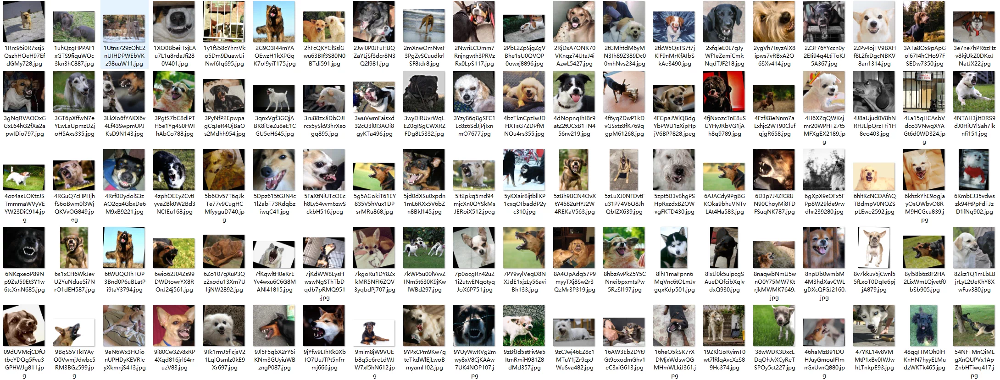
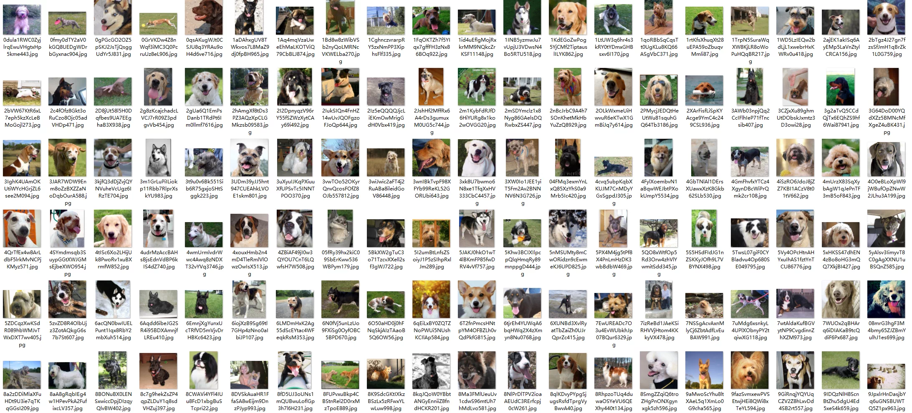
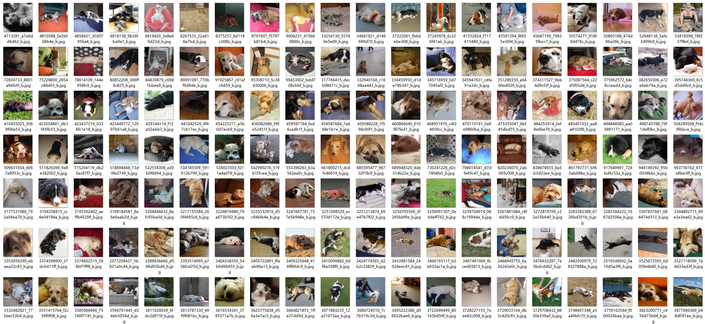
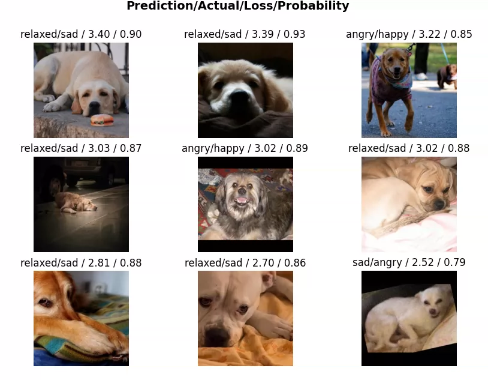

## Body

Dog Emotion Classification Dataset

The dataset is a mixed and manually cleaned collection, created by merging images from multiple public dog emotion datasets and carefully reviewed to reduce label noise.

The dataset contains dog pictures categorized into four classes of emotion:
Anger: 931 images
Happy: 989 pictures
Relaxation: 979 images
Sadness: 977 pictures

## Images

Here is a pay link on Stripe ( https://buy.stripe.com/3cs8yP7sY87d0vu9AB ). Please contact me lonlonago@foxmail.com after funding $89, and I will send you a complete data files , thank you!

